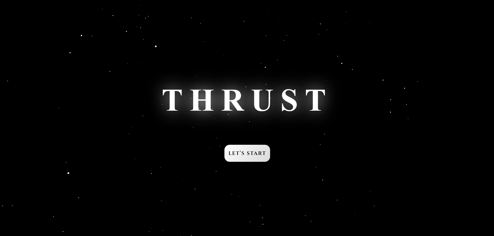
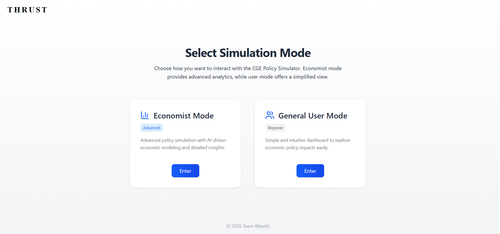
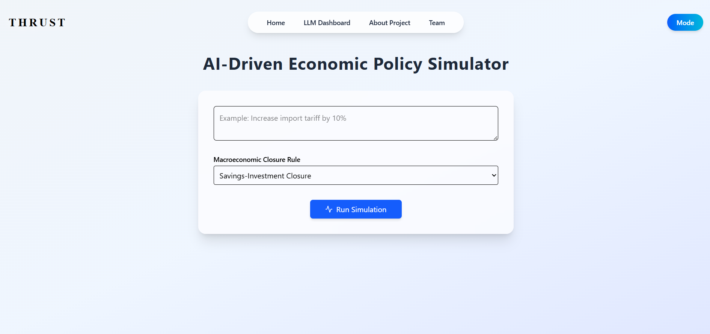
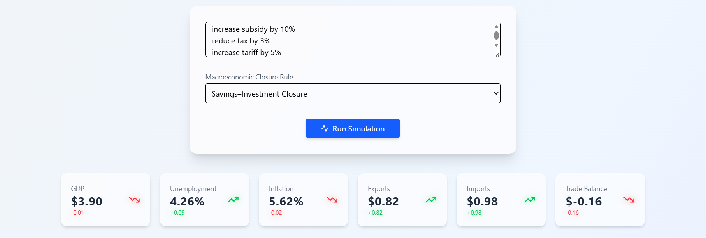
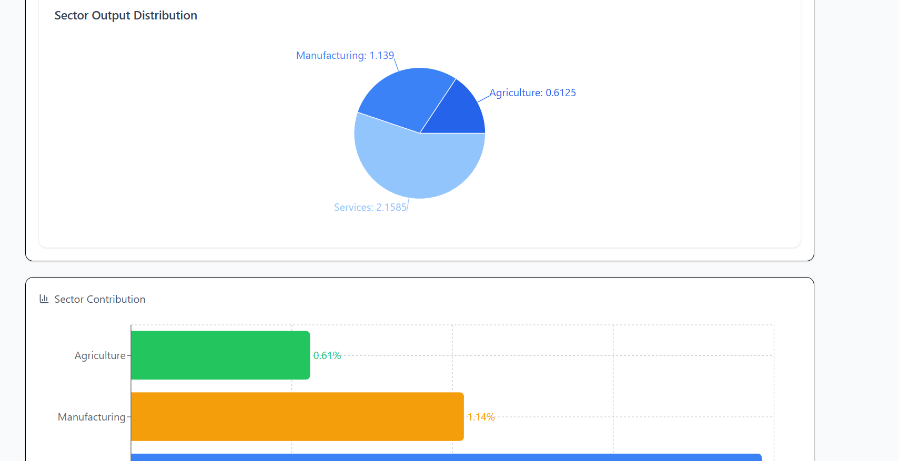
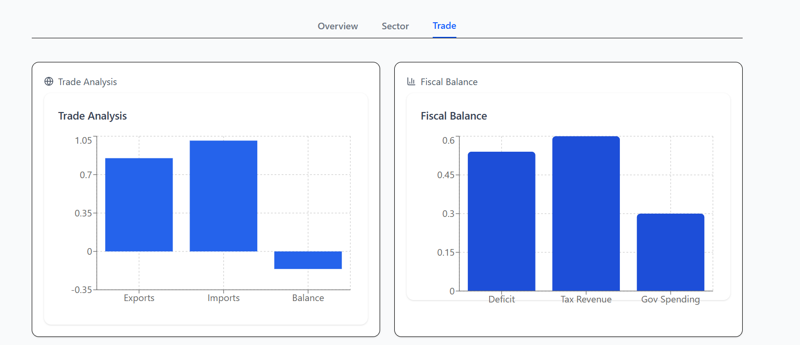
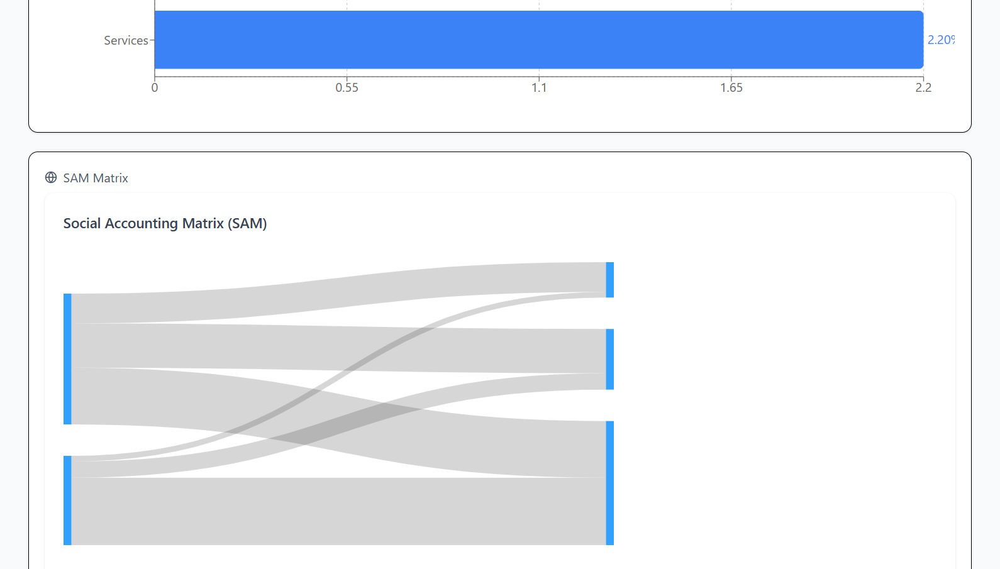
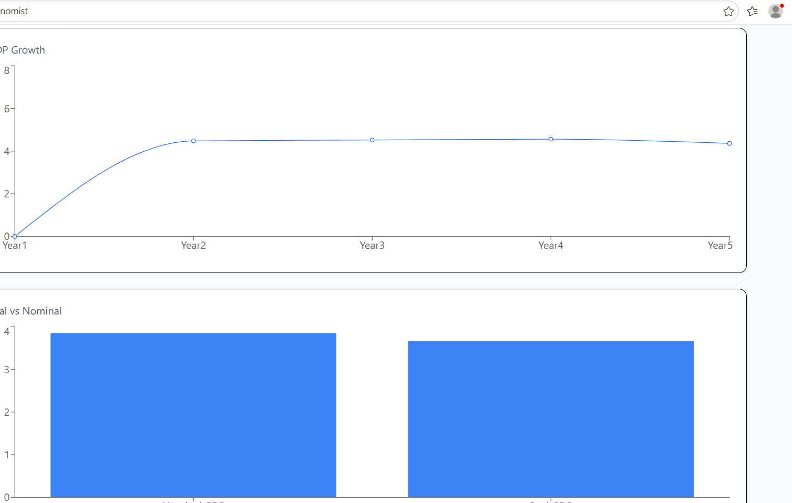
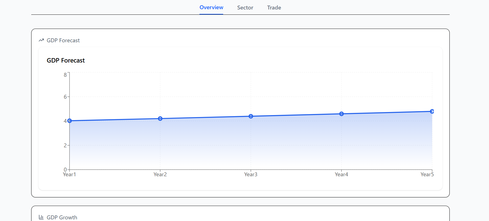

# THRUST – AI Driven Economic Policy Simulator

## Introduction

THRUST is an AI-powered macroeconomic policy simulation platform designed to analyze the impact of economic policies on national economic indicators. The system allows users to experiment with fiscal, trade, and industrial policies through an interactive dashboard backed by an economic simulation engine.

The project is designed for policymakers, researchers, students, economists, and analysts who want to evaluate how policy decisions influence economic performance.

THRUST combines Artificial Intelligence, economic modeling, and interactive data visualization into a single platform capable of transforming natural language policy instructions into structured simulation parameters.

---

# Project Objective

The primary objective of THRUST is to provide a realistic and interactive environment for testing economic policy decisions before implementation.

The simulator enables users to:

* Analyze GDP growth under different policy conditions
* Evaluate inflation and unemployment changes
* Study fiscal and trade policy impacts
* Observe sector-wise economic output distribution
* Compare economic forecasts across scenarios
* Use AI-generated policy interpretation through natural language input

---

# Key Features

## Dual Interface System

THRUST provides two separate user interfaces:

### General User Interface

Designed for students and general users.

Features:

* Simple policy input system
* AI policy assistant
* Easy-to-understand visualizations
* Simplified economic indicators dashboard
* Interactive graphs and charts

### Economist Interface

Designed for advanced users and researchers.

Features:

* Detailed policy configuration
* Advanced economic indicators
* Sector-level analysis
* Fiscal and trade policy simulation
* Forecasting and trend analysis
* Multi-variable economic visualization

---

# System Architecture

The system is divided into two major components.

## Frontend Architecture

The frontend is built using React and modern UI technologies.

### Frontend Features

* Interactive policy dashboard
* Real-time data visualization
* Economic indicator panels
* Trade and fiscal analytics charts
* AI policy interaction system
* Responsive user interface
* Sector output distribution graphs
* Forecast visualization engine

### Frontend Technologies

* React
* Tailwind CSS
* Vite
* JavaScript
* Chart Libraries

---

## Backend Architecture

The backend is developed using FastAPI and Python.

The backend handles:

* Economic simulations
* Policy calculations
* Forecast generation
* AI policy interpretation
* Data processing
* Economic indicator computation

### Backend Modules

#### Production Model

Simulates production behavior across economic sectors.

#### Fiscal Policy Module

Analyzes the impact of government spending, subsidies, and taxation.

#### Labor Market Model

Calculates unemployment and labor market effects.

#### Trade Model

Simulates imports, exports, tariffs, and trade balance changes.

#### GDP Forecasting Engine

Predicts GDP movement based on applied economic policies.

#### Policy Interpretation Engine

Converts natural language policy instructions into structured simulation parameters.

---

# AI Policy Assistant

THRUST includes an AI-powered policy assistant capable of understanding natural language instructions.

Users can enter policies in plain English such as:

```text
increase manufacturing subsidy by 10%
reduce tax by 3%
increase tariff by 5%
```

The AI assistant interprets these instructions and converts them into structured policy parameters used by the economic simulation engine.

---

# AI Model and API

The AI assistant is powered using the Groq API.

### Model Used

```text
LLaMA-3.1-8B-Instant
```

The model is responsible for:

* Natural language understanding
* Policy extraction
* Parameter identification
* Simulation instruction generation

---

# External APIs Used

## Groq API

Used for:

* AI policy interpretation
* Natural language processing
* User prompt analysis

Official Website:

```text
https://groq.com/
```

---

# Project Workflow

1. User enters economic policy instructions.
2. AI assistant interprets the policy.
3. Backend converts policy into simulation parameters.
4. Economic models process the data.
5. Forecasting engine predicts economic outcomes.
6. Frontend displays visual analytics and graphs.

---

# Installation Guide

## Clone the Repository

```bash
git clone https://github.com/your-username/thrust-ai-policy-simulator.git
```

```bash
cd thrust-ai-policy-simulator
```

---

# Backend Setup

Navigate to backend directory:

```bash
cd backend
```

Install required dependencies:

```bash
pip install -r requirements.txt
```

Run FastAPI server:

```bash
uvicorn main:app --reload
```

Backend server will start at:

```text
http://127.0.0.1:8000
```

---

# Frontend Setup

Navigate to frontend directory:

```bash
cd frontend
```

Install dependencies:

```bash
pnpm install
```

Run frontend development server:

```bash
pnpm run dev
```

Frontend will start at:

```text
http://localhost:5173
```

---

# API Key Configuration

The project requires a Groq API key to run the AI Policy Assistant.

## Linux / Mac

```bash
export GROQ_API_KEY=your_api_key_here
```

## Windows

```bash
set GROQ_API_KEY=your_api_key_here
```

The backend securely reads the API key from environment variables.

---

# Simulation Example

Example policy input:

```text
increase manufacturing subsidy by 10%
reduce tax by 3%
increase tariff by 5%
```

The simulator generates:

* GDP impact analysis
* Inflation changes
* Unemployment forecasts
* Trade balance changes
* Sector output distribution
* Forecasting graphs
* Fiscal impact analysis

---

# Economic Indicators Supported

The simulator currently evaluates:

* Gross Domestic Product (GDP)
* Inflation
* Unemployment
* Government Revenue
* Trade Balance
* Imports and Exports
* Industrial Output
* Manufacturing Growth
* Fiscal Deficit
* Sector Contribution

---

# Technology Stack

## Frontend

* React
* Tailwind CSS
* Vite
* JavaScript
* Chart Visualization Libraries

## Backend

* FastAPI
* Python
* NumPy
* Pandas
* Economic Simulation Engine

## Artificial Intelligence

* Groq API
* LLaMA-3.1-8B-Instant

---

# Output Screenshots

## Dashboard Interface


## Policy Simulation



## GDP Analysis



## Economic Forecast Graph



## Sector Distribution Analysis



## Fiscal Policy Dashboard



## Trade Analysis



## Economist Interface



## AI Policy Assistant



---

# Use Cases

THRUST can be used for:

* Economic policy experimentation
* Academic research
* Government policy simulation
* University projects
* AI and economics integration studies
* Macroeconomic forecasting
* Interactive economic education

---

# Future Improvements

Planned future enhancements include:

* Real-time economic datasets
* Multi-country simulation support
* Advanced CGE modeling
* Scenario comparison engine
* Historical economic data integration
* Policy recommendation system
* AI-generated economic insights
* Exportable reports and analytics

---

# Team

## Team THRUST

AI Driven Economic Policy Simulator

---

# License

This project is developed for academic, research, and educational purposes.

---

# Conclusion

THRUST combines Artificial Intelligence with economic modeling to create a powerful policy simulation platform. The system enables users to understand the consequences of economic decisions through interactive simulations, forecasting models, and AI-assisted policy interpretation.

The project demonstrates the integration of AI, economics, data visualization, and full-stack development into a unified decision-support system.
